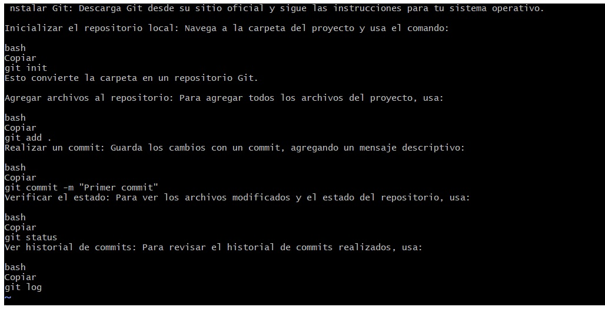

 instalar Git: Descarga Git desde su sitio oficial y sigue las instrucciones para tu sistema operativo.

Inicializar el repositorio local para Navegar a la carpeta del proyecto y usa el comando:

bash
Copiar
```
git init
```
Esto convierte la carpeta en un repositorio Git.

Agregar archivos al repositorio: Para agregar todos los archivos del proyecto, usa:
```
git add
```
Realizar un commit: Guarda los cambios con un commit, agregando un mensaje descriptivo:
```
git commit -m "Primer commit"
```
Verificar el estado: Para ver los archivos modificados y el estado del repositorio, usa:
```
git status
```
Ver historial de commits: Para revisar el historial de commits realizados, usa:
```
git log
``` 



